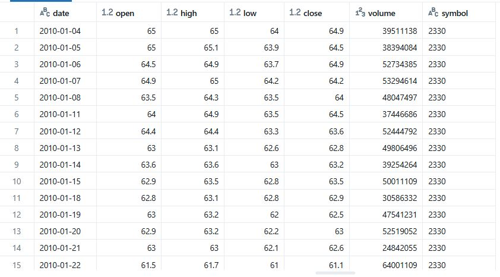

# Databricks_ETL_TWstocks

### For Recuiters:
I recommend watching [this video] for a quick assessment of my abilities. The video is a review of this project.

## Inspiration:
This project is inspired by the idea of building a Databricks ETL pipeline for Taiwan stocks, aiming to explore quantitative trading strategies related to MVRH (Monthly Volume Record High). MVRH is the feature that I want to explore more by ML. The design follows the Databricks multi-layer data lake architecture (Bronze/Silver/Gold) and integrates Azure Data Lake Storage Gen2 as the storage source.

## Navigation:
- The main part is in [advanced-dlt pipeline](./advanced-dlt%20pipeline), where I implemented a "Lakeflow Declarative Pipeline" (also known as "DLT") to complete this project.
- If you're new to Databricks, [basic-manual pipeline](./basic-manual%20pipeline) is a manual ETL pipeline where you might learn something from.

- Both of them are doing the same thing but different way.

## Reminder:
daily-extration.py and monthly-extration.py are not necessary for this project but their works are necessary. It includes a API for Taiwanese to extract stocks data and sends them to Azure Data Lake Storage Gen2. So if you can't use the API in those file and you really want to run through this project, prepare candle stick data in the way you like and send them to your storage. The data would be like this:

