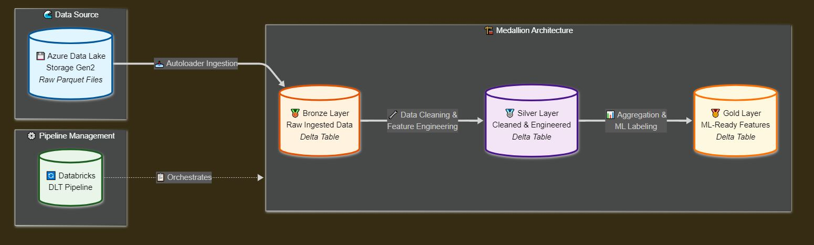

# Databricks_ETL_TWstocks
- ### [video review](https://youtu.be/XXX)


## What it does:
- Connects to Azure Data Lake and reads daily and monthly Parquet candlesticks data for Taiwan stocks (using 2330[TSMC] as an example).
- Bronze layer: Extracts raw daily and monthly data and stores them as Delta Tables. With Autoloader's help, we can incrementally fetch new data from the source storage instead of scanning the whole source. It tests data quality by "expect".
- Silver layer:
  - For monthly data feature engineering: calculates Monthly Volume Record High (MVRH) and the percentage distance from the last MVRH.
  - For daily data feature engineering: calculates the highest/lowest return in the next 60 days. Note the definition of lowest return is the lowest "before" it hits the highest point during the period.
- Gold layer:
  - Further aggregates features from the Silver layer to produce tables suitable for machine learning (e.g., days since last MVRH, return rates, 60-day profitability labels, etc.).

## How to start it (databricks):
1. In Databricks, create a new pipeline and set the source codes as 2python.dlt_pipeline and 2sql.dlt_pipeline:
2. Make sure you have set up Azure Data Lake IAM permissions and Databricks connection (refer to the [YouTube tutorial](https://www.youtube.com/watch?v=VkjqViooMtQ)).
3. Watch my video.

## Good SQL/Pyspark to learn:
- **Window Functions for Running Maximum (Silver Layer)**
  ```sql
  MAX(volume) OVER (ORDER BY date) AS max_volume_so_far
  ```
  *Purpose: Calculates the running maximum of volume up to each row, useful for identifying record highs.*

- **All-Spark Distributed Feature Engineering (advanced-dlt pipeline)**
  ```python
  # Using PySpark DataFrame and Window functions to calculate 60-day future high/low returns
  from pyspark.sql.window import Window
  from pyspark.sql.functions import col, max as spark_max, min as spark_min, row_number
  # ... see 2python.dlt_pipeline.ipynb for full logic
  ```
  *Purpose: Leverages Spark's distributed computation (Window, Join, GroupBy, etc.) to process large-scale data efficiently. All feature engineering is performed on the Spark cluster, making it scalable and production-ready.*

- **Pandas UDF for Complex Feature Engineering (basic-manual pipeline)**
  ```python
  @pandas_udf(returnType=StructType([...]))
  def calculate_future_returns(closes: pd.Series, highs: pd.Series, lows: pd.Series) -> pd.DataFrame:
      # Use pandas to loop and calculate future high/low returns for each row
  ```
  *Purpose: Uses pandas for complex logic, which is intuitive and easy to debug. Suitable for small data or prototyping, but not scalable for big data.*

- **Design Difference**
  > The advanced-dlt pipeline uses all-Spark distributed computation for the silver layer, suitable for large-scale, scalable ETL. The basic-manual pipeline uses pandas UDF for the silver layer, which is easier for teaching and prototyping but not suitable for big data. This design demonstrates both production-grade and educational approaches. And the most important note is that if you force it to use pandas for dealing with the calculation logics in silver layer, the fhr/flr features would be totally wrong because spark is inherently set between tables in DLT pipeline so the data index would be messy when we send them to pandas udf because spark's distributed processing and possible shuffling.

  ## Reminder:
  I use both SQL and pyspark in this project. This is not necessary. I do this for learning purposes.
  (It's not allowed to use one notebook containing sql and python at the same time in DLT. So setting them into different notebooks is needed.)
