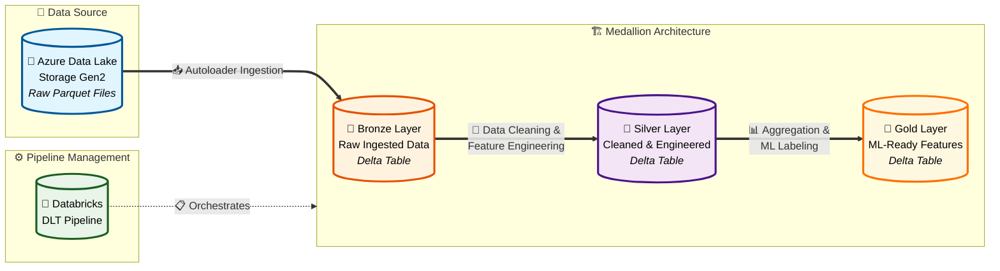

```mermaid
flowchart LR
    subgraph "🌊 Data Source"
        A[("💾 Azure Data Lake<br/>Storage Gen2<br/><i>Raw Parquet Files</i>")]
    end
    
    subgraph medallion ["🏗️ Medallion Architecture"]
        direction LR
        B[("🥉 Bronze Layer<br/>Raw Ingested Data<br/><i>Delta Table</i>")]
        C[("🥈 Silver Layer<br/>Cleaned & Engineered<br/><i>Delta Table</i>")]
        D[("🥇 Gold Layer<br/>ML-Ready Features<br/><i>Delta Table</i>")]
    end
    
    subgraph "⚙️ Pipeline Management"
        E[("🔄 Databricks<br/>DLT Pipeline")]
    end
    
    %% Data Flow
    A ===>|"📥 Autoloader Ingestion"| B
    B ===>|"🔧 Data Cleaning &<br/>Feature Engineering"| C
    C ===>|"📊 Aggregation &<br/>ML Labeling"| D
    
    %% Management Flow
    E -..->|"📋 Orchestrates"| medallion
    
    %% Styling
    classDef sourceStyle fill:#e1f5fe,stroke:#01579b,stroke-width:3px,color:#000
    classDef bronzeStyle fill:#fff3e0,stroke:#e65100,stroke-width:3px,color:#000
    classDef silverStyle fill:#f3e5f5,stroke:#4a148c,stroke-width:3px,color:#000
    classDef goldStyle fill:#fff8e1,stroke:#ff6f00,stroke-width:3px,color:#000
    classDef pipelineStyle fill:#e8f5e8,stroke:#1b5e20,stroke-width:3px,color:#000
    
    class A sourceStyle
    class B bronzeStyle
    class C silverStyle
    class D goldStyle
    class E pipelineStyle
```