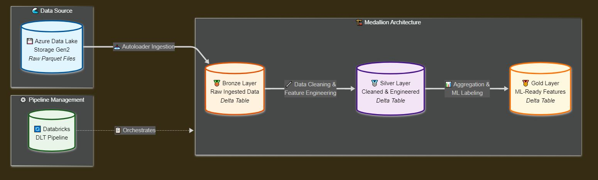

# Databricks_ETL_TWstocks

Chia-Ming Hu (Ken)

Github repo : https://github.com/garmenty485/Databricks_ETL_TWstocks

---

# Content

- Run through the process  
- Main obstacles during development

---

---

# 1. Run through the process

 - Setup the Lakeflow Declarative Pipeline (DLT)
 - First batch  
 - Following batches 

---
# 2. Obstacles during development

 - How Autoloader handles schema changes
 - Notebooks main language  
 - DLT distributed computation (shuffling) 
